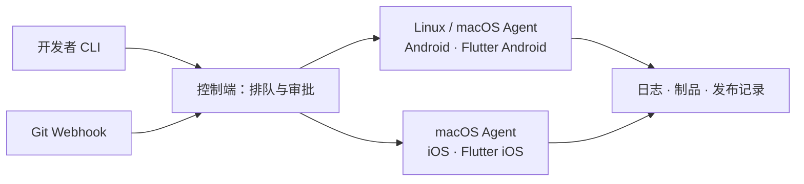

<div align="center">

# mybuilds

**在自己的构建机上，构建和发布移动应用。**

Android · iOS · Flutter ｜ YAML 流水线 ｜ 自托管 ｜ 纯 CLI

[快速开始](#快速开始) · [移动工程接入](#移动工程接入) · [使用文档](docs/USAGE.md) · [参与贡献](#参与贡献)

</div>

---

mybuilds 是面向移动开发团队的构建与发布工具。把构建流程写进仓库中的 `mybuilds.yml`，先在本地调通，再交给自己的 Linux 或 macOS 构建机执行。构建参数、任务排队、日志、制品和发布审批都通过命令行管理。

工程继续使用已有的 Gradle、Xcode、Flutter 和 shell 脚本；商店发布集成 fastlane，也支持接入自己的发布脚本。

> **项目状态**：核心构建与调度流程已实现，当前从源码安装。iOS / Flutter 签名、商店发布和外部 Git 平台 Webhook 投递尚未完成真实环境验收，详见[平台与限制](#平台与限制)。

## 为什么用 mybuilds

- **本地调通，再交给构建机** — 本地与 Agent 共用流水线引擎，支持执行前预览配置。
- **围绕移动工程组织构建** — 内置原生 Android、iOS 和 Flutter 模板，通过参数传入版本、构建号和渠道。
- **管理自己的构建资源** — 按平台、标签和容量选择 Linux / macOS 节点；默认 SQLite，也可使用 PostgreSQL。
- **保留每次构建的依据** — 远程构建固定 Git 提交，集中保存日志、制品和 JUnit 报告，制品下载校验 SHA-256。
- **把审批放进发布流程** — 审批通过后在原节点继续执行，集成 Google Play、App Store 和自定义发布流程。
- **从代码推送触发构建** — 接收 GitHub、GitLab、Gitee 和通用 Webhook，支持去重、变更路径筛选和触发等待窗口。

适合已有移动工程、希望复用自有构建机，并通过 CLI 管理团队构建的开发者。已有 Fastfile 可以通过[自定义发布](examples/custom/README.md)接入。

## 安装

准备 **Go 1.25.0+** 和 **Git**，下载仓库源码后，在包含 `go.mod` 的根目录执行：

```bash
mkdir -p bin
go build -o bin/mybuilds ./cmd/mybuilds
export PATH="$PWD/bin:$PATH"
mybuilds --help
```

以上命令适用于 macOS / Linux，PATH 设置仅对当前终端生效。运行下面的本地示例只需要客户端，无需部署控制端或安装移动 SDK。

<details>
<summary>部署远程构建：编译控制端和 Agent</summary>

在对应机器的源码根目录执行：

```bash
go build -o bin/mybuilds-server ./cmd/mybuilds-server
go build -o bin/mybuilds-agent ./cmd/mybuilds-agent
```

控制端与 Agent 可以部署在同一台机器。启动、身份配置和节点登记见[部署指南](docs/USAGE.md#控制端与远程排队)。

</details>

## 快速开始

下面的例子执行一个 shell 脚本，再把生成的文件保存为构建制品。无需移动工程或 SDK。

### 1. 创建工作目录

完成安装后，在同一终端执行：

```bash
mkdir mybuilds-demo
cd mybuilds-demo
```

### 2. 定义流水线

新建 `mybuilds.yml`：

```yaml
version: 1
steps:
  - kind: run
    name: build
    run: |
      mkdir -p output
      printf 'hello mybuilds\n' > output/hello.txt
  - kind: artifact
    name: collect
    paths: [output/hello.txt]
```

`run` 执行脚本，`artifact` 收集文件并保存独立快照。这个配置简化自[制品示例](examples/local-artifacts.yml)。

### 3. 预览并执行

```bash
mybuilds run --dry-run
mybuilds run > result.json
cat output/hello.txt
```

输出：

```text
hello mybuilds
```

`--dry-run` 只校验并预览配置。实际执行时，日志写入 stderr，结果 JSON 写入 stdout。本例的 `result.json` 中，`builds[0].status` 应为 `succeeded`，`result_dir` 指向日志与制品快照目录。

接下来可以把脚本换成自己的构建命令，或参考[参数与条件](examples/local-run.yml)、[JUnit 报告](examples/local-reports.yml)和[多构建配置](examples/pipeline-preview.yml)示例。

## 移动工程接入

在**已有移动工程根目录**选择对应命令，生成可编辑的 `mybuilds.yml`：

| 工程 | 初始化命令 | 接入指南 |
|---|---|---|
| 原生 Android | `mybuilds init --platform android` | [Android 示例](examples/android/README.md) |
| 原生 iOS | `mybuilds init --platform ios` | [iOS 指南](specs/005-ios-build/quickstart.md) |
| Flutter 双平台 | `mybuilds init --framework flutter --platform android,ios` | [Flutter 示例](examples/flutter/README.md) |

按工程实际情况修改模板中的应用标识、工程路径、签名环境引用和制品路径。然后预览配置并执行构建。以 Android 为例：

```bash
mybuilds run --build android --param version=1.2.3 --param build_number=42 --dry-run
mybuilds run --build android --param version=1.2.3 --param build_number=42
```

初始化不会覆盖已有配置，也不会创建移动工程或安装 SDK。Android 模板默认收集 APK、AAB 和 R8 mapping，需按工程实际输出调整。

一份配置可以包含多个命名构建，例如 `android` 和 `ios`。使用 `--build android,ios` 选择多个构建，或用 `--all` 选择全部；本地依次执行，远程按节点容量调度。

## 远程构建

需要团队共用构建机时，部署控制端和 Agent：



三个程序各有职责：

| 程序 | 职责 |
|---|---|
| `mybuilds` | 生成配置、本地调试、提交远程任务、查看日志和下载制品 |
| `mybuilds-server` | 管理项目、权限、队列、审批和构建记录 |
| `mybuilds-agent` | 主动连接控制端，在构建机上执行任务并回传结果 |

从[部署指南](docs/USAGE.md#控制端与远程排队)开始，配置控制端、登记 Agent 和项目并授权节点，再通过 CLI 提交构建。没有合格 Agent 时，任务保持排队；同项目同名构建串行，不同构建可按容量并行。

商店发布由远程 Agent 执行。发布前需准备渠道工具和凭据，管理员触发构建时需显式传入 `--allow-upload`，详见[发布与审批](docs/USAGE.md#审批与webhook)。

## 平台与限制

| 运行环境 | 客户端 | 本地执行 / 控制端 / Agent | 移动构建目标 |
|---|---|---|---|
| macOS | 支持 | 支持 | Android、iOS、Flutter Android / iOS |
| Linux | 支持 | 支持 | Android、Flutter Android |
| Windows | 远程操作、配置生成与预览 | 暂不支持 | 交给远程节点执行 |

移动构建需要自行准备工具链：Android 使用 Java 17+、Android SDK 和工程 Gradle wrapper；Flutter 另需 Flutter SDK；iOS 签名需要 macOS 15+、Xcode、有效签名材料，以及启用 cgo 编译的程序。

当前已有原生 Android 真实签名构建验证；真实 iOS / Flutter 签名、Apple / Google 商店发布和外部 Git 平台 push 仍需按[验收指南](docs/ACCEPTANCE.md)验证。完整验证范围见[验证记录](examples/mvp/validation.md)。

mybuilds 采用纯 CLI 形态。机器人通知发送、轮询 / cron 触发尚未实现。Agent 直接在宿主机执行脚本，应使用可信仓库和独立构建账户；跨主机连接需要验证证书的 HTTPS。

## 文档

| 想做什么 | 从这里开始 |
|---|---|
| 配置流水线、部署服务、查阅命令 | [使用指南](docs/USAGE.md) |
| 接入工程或复用流水线 | [示例目录](examples/) |
| 验证真实构建、签名与发布 | [验收指南](docs/ACCEPTANCE.md) |
| 了解代码结构、测试和版本构建 | [开发指南](docs/DEVELOPMENT.md) |
| 了解设计与后续计划 | [产品规划](docs/plans/PLAN.md) · [实施历史](docs/IMPLEMENTATION_HISTORY.md) |

## 参与贡献

欢迎通过 GitHub Issues 报告问题、讨论需求，或提交 Pull Request 改进代码、文档和示例。报告问题时，请附上运行环境、复现步骤和脱敏后的配置与日志。

开发前阅读 [开发指南](docs/DEVELOPMENT.md) 和 [AGENTS.md](AGENTS.md)。程序入口位于 `cmd/`，实现位于 `internal/`，功能规范与验证记录位于 `specs/`。注释与文档使用中文，功能开发遵循项目内的 Spec Kit 流程。

在仓库根目录运行检查：

```bash
go test -p 1 ./...
go vet ./...
```

全套测试使用 `-p 1` 隔离跨包故障注入，不与真实应用验收同时运行。

## 许可证

项目计划在 GitHub 开源，具体许可证待确定；当前仓库尚未包含 `LICENSE` 文件。
