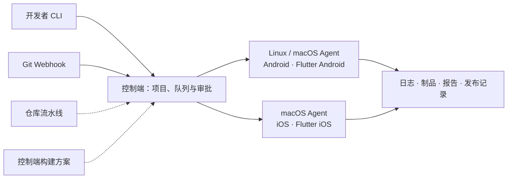

<div align="center">

# mybuilds

**面向 Android、iOS 和 Flutter 的自托管构建与发布工具。**

内置构建方案 · 多节点调度 · 发布审批 · 纯 CLI

[功能](#功能概览) · [安装](#安装) · [接入项目](#接入项目) · [构建与发布](#管理构建与发布) · [工作方式](#工作方式) · [平台与限制](#平台与限制) · [文档与贡献](#文档与贡献)

</div>

---

mybuilds 让移动开发团队通过命令行管理自己的构建机：注册 Git 项目，选择构建方案，触发构建，查看日志、下载安装包，再审批发布。

**应用仓库无需包含 `mybuilds.yml`。** 你可以直接绑定内置构建方案，或使用管理员在控制端维护的自定义方案；也可以把流水线放进仓库，随代码一起管理。

构建继续使用工程已有的 Gradle、Xcode、Flutter 和 shell 脚本。Google Play / App Store 发布集成 fastlane，已有 Fastfile 或其他分发服务可通过自定义发布接入。

> 当前从源码安装。核心流程及必要自动检查已完成；真实 iOS / Flutter 签名、商店发布和外部 Git 平台投递仍有人工待验项，见[平台与限制](#平台与限制)。

## 功能概览

| 你要做的事 | mybuilds 提供的能力 |
|---|---|
| 接入移动工程 | 原生 Android / iOS、Flutter Android / iOS 四套模板与构建方案；`doctor` 检查工具链与签名准备情况 |
| 管理多个项目 | Git 仓库注册、项目分组、可复用方案；一个仓库定义多个命名构建，按项目分配构建号 |
| 调度自有构建机 | 一个控制端管理多个 Linux / macOS Agent，按平台、标签和容量调度；支持节点停接新任务与停用 |
| 控制构建过程 | 参数约束、条件执行、超时与成功 / 失败 / 始终收尾；支持取消、重启状态核对和原快照重试 |
| 查看与保留结果 | 实时日志、制品下载与 SHA-256 校验、JUnit 报告；按构建数量和天数清理历史 |
| 审批并发布 | 审批后在原节点继续；已配置的测试报告失败时阻止发布；支持 Google Play、App Store 和自定义发布结果核对 |
| 自动触发构建 | GitHub、GitLab、Gitee 和通用 Webhook，支持去重、变更路径筛选和触发等待窗口 |

## 安装

准备 **Go 1.25.0+** 和 **Git**。下载源码后，在包含 `go.mod` 的仓库根目录执行：

```bash
mkdir -p bin
go build -o bin/mybuilds ./cmd/mybuilds
export PATH="$PWD/bin:$PATH"
mybuilds --help
```

以上命令适用于 macOS / Linux，PATH 设置仅对当前终端生效。本地调试只需要客户端；远程构建还需在对应机器上编译控制端和 Agent：

```bash
go build -o bin/mybuilds-server ./cmd/mybuilds-server
go build -o bin/mybuilds-agent ./cmd/mybuilds-agent
```

<details>
<summary>先试运行：无需移动 SDK 或控制端</summary>

安装客户端后，在同一终端创建一个空目录，生成并执行最小流水线：

```bash
mkdir mybuilds-demo
cd mybuilds-demo
mybuilds init
mybuilds run --dry-run
mybuilds run > result.json
```

默认流水线只打印“请编辑 mybuilds.yml 配置构建步骤”。执行日志写入 stderr，结果 JSON 写入 stdout；`result.json` 的 `builds[0].status` 应为 `succeeded`。`--dry-run` 只校验并预览，不执行脚本或检查实际 SDK。

继续体验[参数与条件](examples/local-run.yml)、[制品收集](examples/local-artifacts.yml)或[JUnit 报告](examples/local-reports.yml)。

</details>

## 接入项目

两种方式使用同一套流水线引擎。**`init` 在本地生成文件，`project init` 向控制端登记项目。**

### 方式一：使用构建方案，仓库不放 YAML

适合统一管理构建规则，或希望直接使用内置移动构建流程的团队。

先按[控制端部署](docs/USAGE.md#控制端与远程排队)和[Agent 部署](docs/USAGE.md#独立节点日志与制品)完成服务配置，准备管理员客户端配置 `client.yml`。构建节点需安装对应 SDK，并通过 Agent 的 `secrets_file` 配置签名所需的秘密引用。

以下以原生 Android 为例。将仓库地址与 `android-builder` 替换为自己的 Git 仓库和已登记节点；示例使用 `main` 分支：

```bash
mybuilds --config ./client.yml project init mobile \
  --repo git@github.com:your-org/your-app.git \
  --nodes android-builder \
  --framework native --platform android

mybuilds --config ./client.yml trigger mobile \
  --build android --param version=1.2.3 --json
```

第一条命令绑定内置 `native-android` 方案，不往仓库写入文件。第二条命令固定 Git 提交并提交构建任务；无合格 Agent 时保持排队。

| 工程 | 创建项目时选择 | 绑定的内置方案 |
|---|---|---|
| 原生 Android | `--framework native --platform android` | `native-android` |
| 原生 iOS | `--framework native --platform ios` | `native-ios` |
| Flutter Android | `--framework flutter --platform android` | `flutter-android` |
| Flutter iOS | `--framework flutter --platform ios` | `flutter-ios` |
| Flutter 双平台 | `--framework flutter --platform android,ios` | 同时绑定两个 Flutter 方案 |

内置方案使用约定的构建任务和制品路径，工程需按[Android](examples/android/README.md)、[iOS](specs/005-ios-build/quickstart.md)或[Flutter](examples/flutter/README.md)指南准备参数、版本与签名接入。默认方案只构建并收集制品，不会自动上传商店。

#### 配置从哪里来

上面的快捷创建方式使用 `auto` 模式。三种来源的行为如下：

| `pipeline.source` | 使用哪份流水线 |
|---|---|
| `auto`（默认） | 优先使用仓库配置；仅当文件不存在时，使用已绑定的构建方案 |
| `repo` | 始终使用仓库配置，文件不存在时报错 |
| `profile` | 始终使用绑定方案，不读取仓库配置文件 |

`auto` 不会因为 YAML 写错或 Git 读取失败而回退；仓库定义与方案定义也不会合并。`profile` 仍需读取应用代码并固定 Git 提交。

如果希望始终使用控制端方案，在仓库外保存 `settings.yml`：

```yaml
pipeline:
  source: profile
  builds:
    android:
      profile: native-android
      params:
        version: "1.2.3"
```

应用到刚才登记的项目：

```bash
mybuilds --config ./client.yml project set mobile --settings ./settings.yml
```

`settings.yml` 是导入控制端的项目管理设置，无需提交到应用仓库。这里会替换项目原有的整个 `pipeline` 设置块；多构建项目需保留所需的全部绑定。

<details>
<summary>使用团队自定义构建方案</summary>

管理员可在控制端的 `server.yml` 中注册方案：

```yaml
build_profiles:
  company-android:
    file: ./profiles/company-android.yml
```

方案文件是一份带 `version: 1`、`steps` 等字段的完整单构建 YAML，不包含 `builds` 外层。移动构建方案需保留相应的 `runner`、参数和签名配置；未声明 `runner` 的通用脚本方案，需在登记项目时指定 `--default-node`。文件路径相对 `server.yml`，由控制端启动时加载，修改后需重启控制端。

在项目设置中把 `profile: native-android` 改为 `profile: company-android`，再导入即可。多个项目可以绑定同一个方案，各自保留独立构建记录。排队任务和重试使用已冻结的定义，不会被后续方案修改替换。

</details>

### 方式二：在仓库中维护流水线

适合需要随代码评审构建脚本、步骤和参数的项目。在已有移动工程根目录生成可编辑配置：

```bash
# 原生 Android；已有 mybuilds.yml 时拒绝覆盖
mybuilds init --framework native --platform android
```

iOS 使用 `--platform ios`，Flutter 双平台使用 `--framework flutter --platform android,ios`。按工程修改生成的 `mybuilds.yml`，然后预览并执行：

```bash
mybuilds run --build android --param version=1.2.3 --param build_number=42 --dry-run
mybuilds run --build android --param version=1.2.3 --param build_number=42
```

需要远程执行时，将配置提交到 Git，再登记项目。以下使用另一项目名 `mobile-repo`，仓库地址和节点名同样需替换：

```bash
mybuilds --config ./client.yml project init mobile-repo \
  --repo git@github.com:your-org/your-app.git \
  --nodes android-builder --file mybuilds.yml

mybuilds --config ./client.yml trigger mobile-repo --build android --json
```

这里的 `project init --file` 指定**仓库内的相对路径**，并选择 `repo` 模式。本地 `run --file /absolute/path/pipeline.yml` 则允许读取仓库外的配置，脚本仍以当前目录为工作目录；本地运行不会自动读取控制端方案。

## 管理构建与发布

一个项目可以包含 `android`、`ios` 或不同变体等命名构建。`--build android,ios` 选择多个，`--all` 选择全部；本地依次执行，远程按节点容量调度。远程同项目同名构建串行，一次批量触发使用同一个 Git 提交。

从 `trigger --json` 返回值的 `builds[].id` 取得 `BUILD_ID`，从制品列表取得 `ARTIFACT_ID`：

```bash
mybuilds --config ./client.yml build show BUILD_ID --json
mybuilds --config ./client.yml logs BUILD_ID --follow
mybuilds --config ./client.yml artifact ls BUILD_ID --json
mybuilds --config ./client.yml artifact download ARTIFACT_ID --output ./app.apk
```

本地 `doctor` 检查构建环境，`doctor --node NODE` 查看节点最近的实际诊断报告。取消、原快照重试与节点维护见[使用指南](docs/USAGE.md)。

发布流程使用 `approval` / `upload` 步骤，由远程 Agent 执行。管理员需绑定应用、准备渠道凭据，并在触发时显式传入 `--allow-upload`。审批后继续使用原构建产物；上传结果未知时保留保护，需核对结果，不会自动重发。详见[审批指南](docs/USAGE.md#审批与webhook)、[Google Play](specs/010-google-play/quickstart.md)、[App Store](specs/011-app-store/quickstart.md)和[自定义发布](examples/custom/README.md)。

## 工作方式



`mybuilds` 是开发者客户端；`mybuilds-server` 管理项目、权限和队列；`mybuilds-agent` 主动连接控制端，在构建机上执行任务。控制端与 Agent 可以同机部署，也可以分开部署。默认使用 SQLite，支持 PostgreSQL。

## 平台与限制

| 运行环境 | 客户端远程操作 / 配置生成与预览 | 本地执行 / 控制端 / Agent | 移动构建目标 |
|---|---|---|---|
| macOS | 支持 | 支持 | Android、iOS、Flutter Android / iOS |
| Linux | 支持 | 支持 | Android、Flutter Android |
| Windows | 支持 | 暂不支持 | 由远程节点执行 |

- **工具链自备**：Android 需要 Java 17+、Android SDK 和工程 Gradle wrapper；Flutter 另需 Flutter SDK；iOS 签名需要 macOS 15+、Xcode、有效签名材料，以及启用 cgo 编译的程序。
- **宿主机执行**：Agent 直接执行可信仓库的脚本，应使用独立构建账户。跨主机连接需要验证证书的 HTTPS。
- **验证范围**：原生 Android 已有真实签名构建记录；iOS / Flutter 签名、Apple / Google 商店操作及外部 Git 平台投递仍有人工待验项。已完成的自动与集成验证见[实施历史](docs/IMPLEMENTATION_HISTORY.md)和[验证记录](examples/mvp/validation.md)。
- **当前范围**：采用纯 CLI 形态；机器人通知发送、轮询 / cron 触发及更多内置分发渠道尚未实现。自定义方案仍用 YAML 描述，暂不支持通过 CLI 逐步添加任意流水线步骤。

## 文档与贡献

| 入口 | 内容 |
|---|---|
| [使用指南](docs/USAGE.md) | 完整部署、配置、命令与故障恢复 |
| [示例目录](examples/) | 移动工程、本地流水线、报告和自定义发布 |
| [验收指南](docs/ACCEPTANCE.md) | 真实构建、签名与发布的验证步骤 |
| [开发指南](docs/DEVELOPMENT.md) | 代码结构、测试与版本构建 |
| [产品方案](docs/plans/PLAN.md) | 项目定位与设计决策；实际交付状态以实施历史为准 |

欢迎通过 GitHub Issues 报告问题、讨论需求，或提交 Pull Request 改进代码、文档和示例。问题报告请附运行环境、复现步骤和脱敏后的配置与日志。

程序入口在 `cmd/`，实现在 `internal/`，功能规范与验证记录在 `specs/`。贡献前阅读 [AGENTS.md](AGENTS.md) 和开发指南；注释与文档使用中文，开发遵循项目内的 Spec Kit 流程。代码检查命令：

```bash
go test -p 1 ./...
go vet ./...
```

`-p 1` 用于隔离跨包故障注入，全套测试不与真实应用验收同时运行。

## 许可证

项目计划在 GitHub 开源，具体许可证待确定；当前仓库尚未包含 `LICENSE` 文件。
