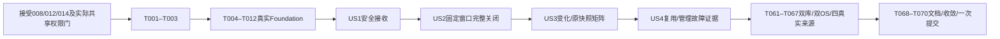

# Tasks: Webhook自动触发、固定等待窗口与changes

**Input**: `specs/015-webhook-trigger/{spec,plan,research,data-model,quickstart}.md` 与 `contracts/`。
**Prerequisites**: 冻结spec/checklist，实际setup-tasks解析项目模板；008/012/014正式验收集成之前不实施，019/发布/审批真实门不豁免。
**状态**: 完整代码与必要自动检查完成；008/012/014正式提交分别504dc6f/76d3000/cd58300。28FR/7SC/17AC保留，外部push与未实际运行的大矩阵人工待验。
**Tests**: 安全、事务、恢复和取消采用真实红→绿；先留原失败，再实现具体消费者。兼容门本来绿则保持，不制造失败、不删原门、不写stub。
**Organization**: US1安全接收 → US2固定窗口/完整关闭 → US3变化语义与原链联验 → US4管理/故障证据；技术共用的diff/条件事实在Foundation先落地，不让窗口关闭调用未来空方法。

## 格式与唯一writer

`- [ ] T### [P?] [US#?] 动作 + 具体路径`。`[P]`仅标同阶段不同writer的红测试；前置均已交接，未标记任务按依赖串行。初次写测试允许真实缺方法/旧行为红，不提供占位实现。

| writer | 唯一业务文件 | 共享边界 |
|---|---|---|
| A 持久化 | `internal/store/webhook.go`、`webhook_models.go`及本功能新tests | 不写现有store模型/迁移/enqueue/retry/recover/query；由root串行 |
| B 来源/条件 | `internal/scm/hook.go`、`changes.go`，`internal/pipeline/changes.go`及新tests | 不写现有git.go/preview.go/run.go；由root串行 |
| C 配置/HTTP | `internal/config/webhook.go`、`internal/server/webhook.go`、`internal/server/webhook_window.go`及新tests | 不写现有config/project/server或server路由/lifecycle；由root串行 |
| root | 协议、所有既有共享文件、CLI新入口/新CLItests、依赖；T002库原型及T037/T049/T059/T062新Server验收tests；文档 | 唯一集成；串行逐SHA同步，不互改同文件 |

新文件须保持表中owner；本任务已把CLI由root唯一承担，不能让C同时写root已有命令文件。PG夹具/锁竞争各用自有数据库并由root串行组织，禁止drop其它库/停其它服务。文件路径在T001以正式接受基线复核后仅由root校正；不复制另一入队路径、执行器、凭据框架或worker。

## Phase 1: Setup与硬前置

- [x] T001 在 `specs/015-webhook-trigger/validation.md` 记录008/012/014正式验收hash并重基线，复核019/商店真实权限门、当前014状态枚举与008完整终态回执；读取 `contracts/{go-api,http,config-changes}.md` 和原则，重核唯一writer及实际共享路径；任何依赖未接受保持待验收、不借源码（root；FR-027/028、SC-007）。
- [x] T002 在 `go.mod`、`go.sum` 和 `internal/scm/webhook_dependency_test.go` 做实际GitHub/GitLab原body两consumer首原型，核验webhooks/v6候选v6.4.0的有限bytes克隆/签名/关闭行为后锁定真实版本与sum；不安装所有provider库或改用动态registry（root；FR-001/004/005）。

## Phase 2: Foundation（全部故事的真实阻塞前置）

- [x] T003 在 `internal/protocol/node.go`、`internal/protocol/webhook_test.go` 红→绿新增具体WebhookEvent/ChangeFacts，固定full/diff、`Paths=[]`、target SHA/摘要边界及optional omitempty旧消息兼容；只数据，不建protocol回调/泛用验证框架（root；FR-004/017/023/025/027）。
- [ ] T004 [P] 在 `internal/store/webhook_migration_test.go` 写两库相同旧008满证据迁移红门，核对RESTRICT、原RetryOf/attempt/receipt/artifact/log不变、二次迁移、事务回滚及 `UNIQUE(group_key,generation)`，不禁全pool FK（A；FR-011/012/014/018/028、SC-007）。
- [x] T005 [P] 在 `internal/scm/changes_test.go`、`internal/pipeline/changes_test.go` 写固定两tree/NUL双路径、真实无base与错误区别、full/diff[]/nil及AND/OR红门；真实自有Git，不从provider文件列表或工作区推断（B；FR-020/021/022/023/025、SC-005）。
- [x] T006 [P] 在 `internal/config/webhook_test.go` 写strict YAML/有限secret/generic描述红门，覆盖null/unknown/type/重复、FIFO/链接/权限/替换、不读host材料与无hook不加载（C；FR-002/003/004/005/009/015、SC-006）。
- [x] T007 在 `internal/config/webhook.go` 实现严格Hook/Triggers/Generic配置及LoadWebhookSecrets：quiet默认0且0至24h、最多64build/每build128参数与值4096B；独立1MiB/128项受限普通envfile，secret32至4096B完整引用、无控制字符；有限RFC6901最多16段/固定合法不重叠头，禁止host env/shell展开（C，T006后；FR-002/003/004/009/015）。
- [x] T008 在 `internal/scm/changes.go`、`internal/pipeline/changes.go` 实现ReadChanges与原when的具体变化匹配：完整commit固定tree、安全gitRunner、rename50%/-l1000/D+A、8MiB/100000路径/1024B/255B/UTF8相对边界；base只精确missing可full，diff错误不截断不假empty，full不绕branch/params（B，T005后；FR-004/007/020/021/022/023/025）。
- [x] T009 在 `internal/store/webhook_models.go` 落地policy/event/alias/window当前具体模型：ProjectID唯一FK RESTRICT、delivery项目/provider/标识三元唯一（跨credential轮换）、group+generation唯一、state/deadline/id索引；generation/revision正int64防溢出，UTC起止、pending→closed|failed，不加closing lease/baseline表（A，T004/T007后；FR-011/012/014/015/018）。
- [x] T010 在 `internal/store/store.go`、`internal/store/models.go`、`internal/store/node_models.go` 串行集成A模型与增量迁移，保旧FK与008回执；在 `internal/config/project.go`、`internal/config/server.go` 加真实Hook/Triggers/WebhookSecretsFile typed入口，运行T004/T006旧新门（root，T009/T007后；FR-002/003/011/018/028）。
- [x] T011 在 `internal/scm/git.go`、`internal/store/enqueue.go`、`internal/server/trigger.go` 红→绿提取已落地ReadPipeline/ReadChanges两consumer的最小bare/init/fetch共享部分及同一私有enqueuePreparedTx/prepareTrigger，原manual两消费者不退化；追加SelectedBuilds、ComparisonKey/Changes/AutomaticWindowID快照，规范完整Definition/Origin(不含Origin.SHA)/最终参数/排序选择比较key，Store复核而非信server摘要（root；FR-009/010/013/017/020/025/027）。
- [x] T012 在 `internal/pipeline/preview.go`、`internal/pipeline/run_types.go`、`internal/pipeline/run.go`、`internal/agent/execute.go` 串行接同一冻结ChangeFacts：旧nil忽略changes，自动事实TargetSHA等Task；full/空diff分别确定，原when共用B helper；动态模板pending不当build.when、原Authority/预算/post不变；Foundation全新旧门绿后冻结SHA交接（root，T003/T008/T010/T011后；FR-017/023/024/025/027）。

**Checkpoint**: protocol/config/Store模型、真实diff/when与现有唯一准备/入队链已可消费。没有运行provider真实门，不宣布依赖接受或功能完成。

## Phase 3: US1 管理员安全连接仓库推送（P1）

**Goal**: 管理员配置独立来源凭据并可信接收持久事件；第一阶段证明安全接收，完整执行AC1在US2/US3闭环复验。
**Independent Test**: 自有四来源实际push验证接收关系，认证/权限/结构错误无event/window/编号；不能把202作为执行成功。依赖Foundation，不依赖空关闭stub。

- [x] T013 [P] [US1] 在 `internal/scm/hook_test.go` 写四provider固定认证/raw-body/头/JSON/ref/repository红门，GitHub/GitLab库真实消费者，Gitee密码与generic HMAC/token明确分开；不以Gitea/Gogs替代Gitee（B；FR-001/004/005/006/007/008、US1.AC2/3）。
- [x] T014 [P] [US1] 在 `internal/store/webhook_receive_test.go` 写admin配置/HookActor及接收原子性红门，独立凭据不接受用户/节点token，错误/ignored无window/号，成功commit才可返接收关系（A；FR-002/003/010/011/012、US1.AC2/5）。
- [x] T015 [P] [US1] 在 `internal/server/webhook_test.go` 写真实HTTP严格入口/管理材料红门：重复关键头、超限、错误密钥、payload URL不访问、秘密隔离；正常HTTP2xx只代表持久接收（C；FR-003/004/005/008/011、US1.AC2/3）。
- [x] T016 [US1] 在 `internal/scm/hook.go` 实现ParseWebhook，已限额bytes克隆后认证、有限全树JSON和固定四provider正规化；8MiB/10s、关键头4096B单份、delivery128B、JSON depth64/tokens200000/member256B/string64KiB；固定sentinel不包装rawerr（B，T013后；FR-001/004/005/007/008）。
- [x] T017 [US1] 在 `internal/scm/hook.go` 完成认证后合法ping/tag/PR/删除忽略receipt，零after仅删除、固定refs/heads与40/64格式；GitLab signing混用拒、Gitee不宣称body签名/稳定delivery，不发明timestamp或猜连接测试（B，T016后；FR-005/006/007、US1.AC3）。
- [x] T018 [US1] 在 `internal/store/webhook.go` 实现ConfigureWebhook/ReadWebhookPolicy/ReceiveWebhook：实际admin/HookActor末尾复核、Settings显式块同事务、policyversion与安全审计、原事件/alias/固定窗口同commit；一次凭据身份与fingerprint、不存body/秘密（A，T014后；FR-002/003/009/010/011/012/014/015）。
- [x] T019 [US1] 在 `internal/server/webhook.go` 实现ConfigureWebhook启用/禁用/轮换的真实材料准备与receiving：crypto/rand32B生成受限key、排他create/fsync再DB；失败仅自产不可见孤儿不授凭据、重复启用/丢ACK不回旧secret；外部引用指纹不符拒且无host fallback（C，T007/T015/T018后；FR-002/003/004/011）。
- [x] T020 [US1] 在 `internal/server/trigger.go`、`internal/server/http.go`、`internal/store/project.go` 接管理入口同事务导入全部显式blocks，真实resolvePipeline仅管理员启用时唯一build推导；多build显式/上传whenfalse仍allow_upload先权限，不伪admin授HookActor（root，T018/T019后；FR-002/009/010/027、US1.AC4/5）。
- [x] T021 [US1] 在 `internal/server/webhook.go` 接公开POST /hook/{project}有限read/provider→ReceiveWebhook及固定HTTP响应，拒query/token URL/encoding/form，失锁503、wrong identity403、重复异内容409；接收不Git/不等node（C，T016/T017/T019/T020后；FR-004/005/007/008/011）。
- [x] T022 [US1] 在 `internal/server/http.go`、`internal/server/server.go` 注册唯一hook路由与admin enable/disable/rotate实际管理路由（仅安全查询延后US4），接收10s/32KiB header约束，保持旧user/node鉴权与stream独立期限；无hook不解析其它项目秘密（root，T021后；FR-003/004/005/027）。
- [ ] T023 [US1] 在 `internal/cli/client/webhook_test.go`、`internal/cli/server/webhook_test.go` 写真实管理CLI红门：hook flags与settings冲突、admin唯一、一次secret仅JSON、坏hook材料不影响local/help/version（root；FR-002/003/009/010、US1.AC4/5）。
- [x] T024 [US1] 在 `internal/cli/client/webhook.go`、`internal/cli/server/webhook.go` 与既有 `internal/cli/client/project.go`、`internal/cli/server/project.go` 接实际project init/add --hook/--hook-repository-key及enable、disable、rotate；同Server.ConfigureWebhook，远程管理mutation不自动重发、在线本机独占拒绝（root，T023/T020/T022后；FR-002/003/009/010）。
- [ ] T025 [US1] 在 `internal/server/webhook_authority_test.go` 通过真实HTTP/Store验证非admin、用户/节点token作secret、payload范围/参数/allow_upload无效，node/app/approval权限仍独立；记录safe失败无对应副作用（C，T021/T022/T024后；FR-002/003/008/009/010/027、SC-006、US1.AC2/3/4/5）。
- [x] T026 [US1] 在 `specs/015-webhook-trigger/validation.md` 记录GitHub/GitLab/Gitee/generic各实际自有push和错secret接收证据、真实delivery/UTC/SHA/中央eventID；generic必须真正post-receive，缺授权/HTTPS材料保持门未过，完整BuildID执行待T065复验（root；FR-001/005/006/028、SC-001、US1.AC1）。

**Checkpoint**: 真实安全管理/接收增量已成立，窗口执行尚需US2；AC1的“对应执行结果”不可在此提前勾完成。

## Phase 4: US2 重投与连续push形成固定窗口（P1）

**Goal**: 固定半开窗口与可信HEAD/全部基线准备，在同一原入队事务关闭、分号并恢复。
**Independent Test**: 两库20并发原投/别名冲突、30s固定截止、乱序强推、四个commit前后重启；真实准备/Enqueue/Run，不模拟关闭成功。

- [ ] T027 [P] [US2] 在 `internal/store/webhook_window_test.go` 写实际两库固定窗口/alias/20竞争红门：same delivery digest跨密钥轮换仍返原、异内容跨轮换仍冲突、同credential换未签delivery但同body仍别名；原[OpenedAt,Deadline)不延长，0s/截止恰好/new generation/晚旧due并存（A；FR-011/012/014/015/018、SC-002/003、US2.AC1/2）。
- [ ] T028 [P] [US2] 在 `internal/server/webhook_window_test.go` 写真实Git+Store关闭红门：倒序/force push只固定授权HEAD、之后推进不变、45s父预算、无DB锁Git、policy/baseline CAS变动重准备；不读payload URL（C；FR-016/017/018/019/021、SC-003/004、US2.AC3/4）。
- [x] T029 [US2] 在 `internal/store/webhook.go` 完善接收delivery项目/provider/标识三元唯一（跨credential轮换）/别名事务与窗口分代限额，Store UTC原期限/revision不溢出，截止后事件另代、ignored无window；全部错误无号、精确重投不改已关闭归属（A，T027后；FR-011/012/014/015/018）。
- [x] T030 [US2] 在 `internal/store/webhook.go` 实现DueWebhookWindows/ReadWebhookWindow与FindWebhookBaseline，按comparison key精确成功/无stopguard/full manifest、008 Kind=build_finished/StopKnown/当前seq+attempt/digest与中央CreatedAt排序；旧无key/可信receipt视missing，不猜UpdatedAt（A；FR-016/020/021）。
- [x] T031 [US2] 在 `internal/store/webhook.go` 实现CloseWebhookWindow/FailWebhookWindow最后短事务CAS：锁、HookActor/current PolicyVersion、window revision/state/deadline、全部最新baseline、选中配置/上传/node/app权限；此阶段即实现完整SemanticKey受保护auto结果reuse（T051再扩边界门），zero fresh无空batch；复用原enqueuePreparedTx，closed+fresh/reused全部关系+计数同commit，失败整体rollback（A，T011/T029/T030后；FR-009/010/017/018/019/027）。
- [x] T032 [US2] 在 `internal/server/webhook_window.go` 实现完整close准备：已接受012固定source、可信branch HEAD、全部参数/definition/key→最新baseline→真实ReadChanges→同Preview/静态build.when；每build冻结full/diff与准确reason，动态系统模板pending不判false（C，T008/T011/T012/T028/T030/T031后；FR-016/017/020/021/023/024）。
- [x] T033 [US2] 在 `internal/server/webhook_window.go` 实现原45s内CAS冲突完整重准备、固定截止不续命、固定failed原因；ReadChanges缺base可full但目标/配置/权限/超限/diff错误不得冒称缺基线；任何Git cleanup未确认都无用户执行（C，T032后；FR-016/017/018/019/021）。
- [ ] T034 [US2] 在 `internal/server/server.go`、`internal/store/enqueue.go` 串行接原生命周期tick1s/due页100与具体Close私有enqueue两consumer，停止/永久失锁立即停接收/关闭；无新scheduler/closing lease；同批zero fresh不造空batch（root，T031/T033后；FR-017/018/019/027）。
- [x] T035 [US2] 在 `internal/store/webhook_close_test.go` 以真实第二DB连接/约束失败/锁丢失验证close rollback、PolicyVersion/receipt baseline竞争、重复close结果稳定、没有部分分号或改queued/running/paused；原deadline保留（A；FR-017/018/019、SC-004、US2.AC4）。
- [ ] T036 [US2] 在 `internal/server/webhook_fixed_sha_test.go` 实际advance/force push/乱序delivery、仓库配置损坏与截止边界联验，所有selected share真实固定SHA，真实diff/Run/产物摘要相同，不追后来HEAD（C；FR-007/016/017/018、SC-003、US2.AC3）。
- [ ] T037 [US2] 在 `internal/server/webhook_restart_test.go` 用真实独立Server/CLI子进程跑接收commit前/后、关闭commit前/后四退出点；证据用实际SQL失败/锁/已确认响应，不新增生产testhook，重启与并发close不重号/不改旧任务（root；FR-011/018/019/027、SC-004、US2.AC4）。
- [x] T038 [US2] 在 `specs/015-webhook-trigger/validation.md` 记录20delivery竞争/异内容、30s的0/10/29秒实际push、范围隔离/乱序/force push与自有正常仓库截止60s内唯一结果；复验US1实际执行关联，不以payload回归替代来源真门（root；FR-012/014/015/016/018、SC-002/003/004、US2.AC1/2/3/4）。

**Checkpoint**: 真实安全接收→due准备→原子关闭→同Run的完整链已具备；高级变化/手动retry/权限组合仍由US3/US4证明，不伪完全独立。

## Phase 5: US3 只自动执行受变化影响的定义（P2）

**Goal**: 比较范围与完整成功证据不混用，变化事实一路冻结，手动/local与原快照retry保持语义。
**Independent Test**: 实际Git新增/修改/删除/改名/公共目录/无变化，变化条件与分支/参数AND；首缺/full和各错误分离、retry不再diff。复用已落地Foundation/US2，不建第二差异执行器。

- [ ] T039 [P] [US3] 在 `internal/store/webhook_baseline_test.go` 写两库比较范围/终态可信时间红门：参数/分支/名称/排序选择/完整定义/来源隔离，Origin.SHA与动态编号不入key；manual/retry成功可作baseline、旧不明receipt/key/full保护不作基线（A；FR-020/021/025、SC-005、US3.AC2/4）。
- [x] T040 [P] [US3] 在 `internal/scm/changes_matrix_test.go` 写真实Git路径全矩阵红门：新增/修改/删除/rename旧新/D+A/公共/case、非祖先tree/缺base，坏status/路径/UTF8/控制/..段/超限/网络权限超时不伪full/empty（B；FR-004/020/021/022、SC-005、US3.AC1/2）。
- [x] T041 [P] [US3] 在 `internal/server/webhook_conditions_test.go` 写真实自动preparation/Run条件红门：build&step AND/列表OR/参数AND、pending系统模板非when、skipped无号/容量、ordinary全skip无post、原fail/cancel原因保留（C；FR-009/010/017/023/024、SC-005、US3.AC3）。
- [x] T042 [US3] 在 `internal/store/webhook.go` 完成比较key重算/精确基线及safe投影的矩阵约束，任何最新成功变动使close冲突重准备；current目标错误不变baseline_unavailable，旧证据不补猜（A，T039后；FR-019/020/021）。
- [x] T043 [US3] 在 `internal/scm/changes.go`、`internal/pipeline/changes.go` 完成T040的完整有界diff与字段AND/列表OR语义，使rename无法检测仍D+A双路径、全路径排序唯一+digest；成功空diff与nil/manual区别固定（B，T040后；FR-021/022/023/025）。
- [x] T044 [US3] 在 `internal/server/webhook_window.go` 完成T041对应全selected先校验/每build事实与原source优先级冻结，hasUpload先于when、首缺fixed full reason；任何一个定义/参数错误阻断整窗口、不分号（C，T041/T042/T043后；FR-009/010/017/020/021/023/024）。
- [x] T045 [US3] 在 `internal/pipeline/preview.go`、`internal/pipeline/run.go`、`internal/server/trigger.go` 与 `internal/store/query.go` 串行完成原when/shared事实与公开BuildView安全changes摘要，不公开Paths/Params/Definition；所有ordinary/post沿同facts和原NS预算，dry-run无Git网络（root；FR-017/023/024/026/027）。
- [x] T046 [US3] 在 `internal/store/retry.go`、`internal/store/recovery.go`、`internal/agent/execute.go` 串行接已接受008/014实际consumer：retry保原SHA/Definition/Params/Conditions/Changes/ComparisonKey而清AutomaticWindowID与新执行证据；Recover/Resume不查当前HEAD/基线、不重复旧步骤（root；FR-025/027）。
- [x] T047 [US3] 在 `internal/store/webhook_retry_test.go` 验证手动/原快照retry成功可比较但不受自动永久去重，推进HEAD/改设置仍原条件事实与新号；guard/paused/unknown拒接原8/14规则不变（A；FR-020/025/027、SC-005、US3.AC4）。
- [x] T048 [US3] 在 `internal/pipeline/changes_run_test.go` 实际同Run执行条件、post/预算/取消行为并验证用户Facts的changes.*不能伪造；不解析formatted日志或动态产生另一plan/executor（B；FR-023/024/025/027、SC-005、US3.AC3/4）。
- [ ] T049 [US3] 在 `internal/server/webhook_changes_evidence_test.go` 真Store/Agent/CLI/Git链执行新增/修改/删除/改名双路径/公共目录/首缺/无变化矩阵，source定义/参数/分支切换与manual/local/retry逐项核对SHA/号/摘要（root；FR-020/021/022/023/024/025、SC-005、US3.AC1/2/3/4）。
- [ ] T050 [US3] 在 `specs/015-webhook-trigger/validation.md` 汇总真实路径/比较/Run矩阵与US1.AC1/US2.AC3固定执行闭环证据，首缺全执行与错误安全失败分列，不用通过几个glob单测代替冻结快照链（root；FR-020/021/022/023/024/025/028、SC-005）。

**Checkpoint**: changes自动筛选、手动豁免和retry冻结同链成立；四真实provider与跨平台/两库最终门仍必须全部复验。

## Phase 6: US4 管理策略与故障证据可复核（P2）

**Goal**: 当前授权末尾CAS、无ID自动复用范围和安全查询，故障不重复或伪成功。
**Independent Test**: 真实policy变更/轮换/撤权、未知guard/paused、入队失败与来源错误，安全event/window/changes摘要角色与secret扫描。

- [x] T051 [P] [US4] 在 `internal/store/webhook_semantic_test.go` 写无ID复用红门：同key+SHA仅原auto queued/running/cancel_requested/已接受014 paused/succeeded/stopguard重用；failed/cancelled/interrupted只有已确认可fresh，skipped不永久挡，manual/retry及不同输入不混（A；FR-013/017/019/025、US4.AC2/3）。
- [x] T052 [P] [US4] 在 `internal/server/webhook_policy_test.go` 写真实disable/rotate/secret指纹替换/准备期间撤发布权及query角色红门，旧event可查但旧权不可close，旧运行不自动取消或清unknown（C；FR-002/003/010/019/026/027、SC-006、US4.AC1/3）。
- [x] T053 [US4] 在 `internal/store/webhook.go` 补强US2已完整实现的SemanticKey与auto来源受保护状态reuse矩阵，BuildIDs含fresh+旧引用、ReusedBuildIDs单列；没有fresh BatchID为空，不改旧snapshot/计数/执行权；全部新选择仍校验当前权限（A，T051后；FR-013/017/018/019/025）。
- [x] T054 [US4] 在 `internal/server/webhook.go`、`internal/server/webhook_window.go` 补强US1已有enable/disable/rotate的材料指纹/末尾policy变化fail，新增admin/approver安全事件/窗口查询，外部引用只能显式更新，不从GET恢复旧secret；DTO数组[]与固定reason（C，T052后；FR-002/003/019/026/027）。
- [x] T055 [US4] 在 `internal/store/webhook.go` 完成ListWebhookEvents/Windows与末尾鉴权/控制锁，公开投影不含CredentialID/fingerprint/rawbody/headers/params/Definition/path；确定失败窗口无假batch/号，可依原事件关系核对（A；FR-017/019/026）。
- [x] T056 [US4] 在 `internal/server/http.go`、`internal/server/server.go`、`internal/cli/client/webhook.go`、`internal/cli/server/webhook.go` 串行接hook安全GET和events/windows（复核US1已有rotate/disable） table/JSON、固定错误；只admin/approver读，trigger/node拒，不添加重close/自动retry/approve命令（root，T054/T055后；FR-002/003/026/027）。
- [ ] T057 [US4] 在 `internal/cli/client/webhook_evidence_test.go` 实际CLI/Server/Agent链验证同SHA不同params/selection、无ID合并、manual/retry独立、全部reuse无空batch、秘密扫描与非admin查询拒（root；FR-013/017/019/025/026、SC-006、US4.AC2/3）。
- [x] T058 [US4] 在 `internal/server/webhook_fault_test.go` 用自有DB真实触发失败/控制锁失效/可信repo不可达/非法全selected验证no partial/no号、旧deadline/状态不改及safe固定reason，provider2xx不被当作执行成功（C；FR-011/017/018/019/021/026、SC-004/006、US4.AC3）。
- [ ] T059 [US4] 在 `internal/server/webhook_publish_test.go` 接已验收10/11/14/19的真实应用guard/approval/report边界：allow_upload=false且whenfalse拒，审批跳过不批准、报告失败禁发布、unknown发布无自动确认重发、无合格node不错误迁移（root；FR-010/019/027、SC-006、US1.AC4/5、US4.AC1/4）。
- [x] T060 [US4] 在 `specs/015-webhook-trigger/validation.md` 记录策略/材料/角色/事务故障和复用矩阵、原paused/running/unknown保护的实际不变证据；缺任何依赖的真实消费者保待验收，不手工status/guard绕过（root；FR-013/019/026/027/028、SC-006/007、US4.AC1/2/3/4）。

**Checkpoint**: 所有故事具体consumer和负例具备；真实外部来源/双库/双OS与全检查尚不因代码绿而豁免。

## Phase 7: Polish与整功能真实门

- [ ] T061 在 `internal/store/webhook_application_test.go` 运行SQLite与自有PostgreSQL同套旧满记录迁移/接收/alias/20竞争/窗口/close/baseCAS/计数/权限/4重启点，真独占锁失效、无全pool FK关闭；记录实际驱动/SQL版本与exit（A；FR-011/012/013/014/015/017/018/019/020/028、SC-002/004/007）。
- [ ] T062 在 `internal/server/webhook_application_test.go` 与 `specs/015-webhook-trigger/validation.md` 跑实际macOS/Linux三入口/已注册能力节点相同固定提交、事件与变化结论，真实HTTPS/CA/SSH与中央日志/产物下载；不把通用任务当iOS签名能力（root；FR-027/028、SC-007、US4.AC4）。
- [ ] T063 在 `internal/server/webhook_security_test.go` 统一扫描所有公开HTTP/CLI/table/JSON/日志/快照秘密/rawpayload/私有绝对路径，验证有界慢read/取消/锁失败、auth-before-JSON/RepoURL不访问、wrong-provider头不切策略（C；FR-003/004/005/008/010/026、SC-006）。
- [ ] T064 在 `internal/scm/hook_test.go`、`internal/scm/changes_test.go` 和 `internal/pipeline/changes_run_test.go` 完成所有finite JSON/header/SHA/path/glob/输出/ctx临界值与旧manual/remote兼容检查，保原失败记录，不扩大限额或截断后报无变化（B；FR-004/005/007/021/022/023/024/025、SC-005/006）。
- [ ] T065 在 `specs/015-webhook-trigger/validation.md` 最终核验GitHub/GitLab/Gitee/generic各真实授权push执行+各wrong-secret拒绝、原始投递安全证据/真实SHA/固定deadline/result/日志产物关系；四来源每项独立过门，generic真正post-receive，Gitea/Gogs仅可选兼容不抵Gitee（root；FR-001/005/006/028、SC-001、US1.AC1/2/3）。
- [ ] T066 在 `specs/015-webhook-trigger/validation.md` 按 `quickstart.md` 全流程复验SC-001至007与17AC；缺公网/账号/工程/审批报告商店材料诚实记待验收，不伪造payload成功、不让后续功能反向形成依赖循环（root；FR-028、SC-001/002/003/004/005/006/007）。
- [x] T067 在 `specs/015-webhook-trigger/validation.md` 记录全量test/race/vet、三入口编译矩阵/本机help/version与旧6/7/8/12/14/19必要门；故意全宿主unknown/SIP孤儿故障注入使用已接受基线记录的跨包隔离方式，不放宽unknown，不宣称未运行检查通过（root；FR-025/027/028、SC-007）。
- [x] T068 在 `README.md`、`docs/plans/DELIVERY.md`、`specs/015-webhook-trigger/quickstart.md` 更新实际管理、四provider材料/HTTPS、固定窗口/changes/安全查询/手动retry指南，准确区分接收、执行、审核/上架及未验收材料；不自动通知外部联系人（root；FR-003/026/028）。
- [x] T069 在 `specs/015-webhook-trigger/validation.md` 执行speckit-converge按28FR/7SC/17AC核实源码/行为/真实门；缺口继续本功能implement/converge，不重复创造框架任务，不在未验收时提交（root；FR-001至028、SC-001至007）。
- [x] T070 在 `docs/IMPLEMENTATION_HISTORY.md`、`specs/015-webhook-trigger/validation.md` 完成所有门后记录整功能结论，检查相关差异、使用git-commit-message一次本地提交，报告hash/信息，不按任务提交、不自动push、不夹带其它功能（root；FR-028、SC-007）。

## Dependencies & Execution Order

1. T001是implementation硬门，不把规划文档或未提交类型当接受基线。T002只在门过后对两个实际consumer锁库；T003协议冻结交接后T004/T005/T006三个不同writer红测试可并行。
2. C T007先冻结Hook/Generic真实类型，B T008完成diff/when，A T009随后消费已冻结config类型完成模型；各在自己的红门后实现，root T010–T012按SHA串行整合现有共享文件；Foundation检查全部绿才发故事门。
3. US1 T013–T026先安全接收，US2 T027–T038关闭沿Foundation已真实diff/同enqueue，不等未来空能力；US3 T039–T050补全部变化/旧链矩阵；US4 T051–T060补语义复用/管理故障。US1完整AC1与US2最终固定执行必须在US3后复验，不假称每个story无共享依赖。
4. 各阶段[P]只有当上一阶段真实源码已同步且其固定Go contract可写红测试时启动。implementation/endpoint/integration顺序按显式方法依赖；A/B/C新文件同包旧文件仍root唯一writer，不同故事编辑同文件不能并行。
5. 两库套件完成后才双OS应用门；T065四外部来源真实门不能用T013/T016库payload用例替代；T059真实审批/报告/商店unknown必须使用接受依赖且不反向等待未来16/20。
6. T067检查与T066/真实门全部通过后T068–T070收敛并整功能一次提交；遇真实未确认执行保journal/guard，不删除绕gate。

## Parallel Examples

| 共同前置已过 | 可并行的真实不同writer任务 | 不可同时写的路径 |
|---|---|---|
| T003冻结 | A T004迁移 / B T005diff&when / C T006config红测试 | root共享模型/协议/配置 |
| T012基础绿 | B T013provider / A T014receive / C T015HTTP红测试 | 各自后续生产文件顺序实现 |
| US1交接 | A T027window / C T028closing红测试 | webhook.go/window.go不能跨story并写 |
| US2交接 | A T039baseline / B T040diff矩阵 / C T041conditions红测试 | root trigger/enqueue/run/retry |
| US3交接 | A T051semantic / C T052policy红测试 | root HTTP/CLI唯一接线 |

root只在依赖文件稳定SHA冻结后复制；不能一边改同一共享文件一边接受另一writer覆盖。实际DB/进程验收资源另用自有命名并有真实shutdown证据。

## Implementation Strategy

先交付US1可信接收和拒绝，再交US2真实关闭执行，不以尚未实现的diff/基线/Enqueue返回成功。US3、US4逐增同一准备/执行路径；验收记录随实际红绿交接更新。阶段可有可运行checkpoint，但015最终仍需四来源、两库、双OS、所有权限/恢复门与converge，整功能一次提交。此轮仅生成tasks和只读analyze，不执行任何实现任务/Go业务测试/VM/provider发布。

## 本轮执行归属与验收安排

用户最新授权下，本WT唯一writer实际顺序完成原A/B/C/root共享实现任务，root最终串行merge与整功能提交；[P]不表示本轮同文件并写。T001按2602094真实基线复核，012/014/10/11共享consumer在实际交接后兼容集成，不将未来未集成类型当已验收。T065四外部provider push与T066相关远端材料门留最终用户人工验收；必要本地真实自动安全/双库/Git/恢复门仍必须通过。T070由主代理整功能提交，本分区禁止提交/push。013通知仍后置，无附加通知任务。

## Phase 8: Convergence

- [x] T071 HIGH 按FR-009/FR-017、plan: 唯一来源链（partial），prepareWebhook单build名称推导使用实际012 resolvePipeline，profile强制来源/auto缺repo仍可启用，不额外读取repo文件或第二HEAD。
- [x] T072 HIGH 按FR-013/FR-027、US4/AC2（partial），自动语义合并包含真实waiting_approval/approved状态，原暂停归属和编号不变；以实际挂起/批准记录复投验证。
- [x] T073 HIGH 按FR-013/FR-014/FR-019（contradicts），无delivery或换delivery的body别名仅同策略版本及活动窗口/可复用执行结果合并，失败/取消/过期策略不永久阻止同SHA新自动请求；同delivery精确持久重投仍原归属。

## 最终交付范围与人工门

当前生产任务全部实现，实际test合并于hook_test.go、webhook_test.go、webhook_scope_test.go与changes_test.go等最少文件；路径以validation和源码为准，不按每规划任务另建一套测试文件。已勾仅代表实际实现/已验证最小自动门，四平台公网投递T065、完整双OS/四退出点/30s窗口和其它未实际执行大矩阵保持未勾并集中人工验收。用户最新授权先完整代码及必要检查，再人工验收；本轮双库真实三CLI/profile/两审批/custom/下载/query已118项通过，不冒充真正托管平台push或Apple/Google上传。
