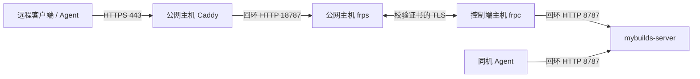

# 实施计划：FRP 远程接入

**Branch**: `main` | **Date**: 2026-10-09 | **Spec**: [spec.md](spec.md)

## Summary

外部 FRP 转发现有 HTTP 控制端，公网 Caddy 提供 HTTPS。不把 FRP 集成进 Go 程序，也不创建第二控制端。此次完成设计和任务，公网部署未执行。



## Technical Context

- **Language/Version**：Go 1.25+ 既有程序不改；FRP 配置为 TOML，Caddy 使用 Caddyfile。
- **Primary Dependencies**：独立 frpc/frps，先与现有服务匹配。本机 frpc 为0.64.0，配置按此版本校验；公网 frps/Caddy 实际版本在部署前盘点，不假定已安装。
- **Storage**：沿用数据库、token、项目和节点，没有迁移。
- **Testing**：配置校验、真实 HTTPS 查询/普通构建/日志/制品与报告、错误证书/身份、重连和回退。
- **Target Platform**：Linux 公网主机，Linux/macOS 控制端主机；当前客户端经 SSH 隧道访问远端。
- **Project Type**：外部服务部署，不新增业务代码或 Go 依赖。
- **Performance Goals**：代理不缩小既有8MiB报告消息与1GiB单制品上限，流式传输；不增加应用超时、租约或报告检查预算。
- **Constraints**：控制端回环监听；新明文转发端口仅回环可达或由主机防火墙限制为回环，IPv4/IPv6都验证；共享 FRP 的 SSH 代理保持。
- **Scale/Scope**：一个公网入口、一个控制端、已有多节点，不加 HA、隧道管理 API、仪表盘或新鉴权层。

## Constitution Check

I：使用specify/plan/tasks/analyze，实施后再implement/converge。II：单控制端与同一Agent执行器保持。III：复用外部FRP/Caddy，无新业务包或Go依赖。IV：校验证书、回环绑定、原身份/租约/未知结果处理保持。V：中文文档、真实接入验收及本地提交。Phase0与Phase1均无原则违反。

## Phase 0：研究决定

见[research.md](research.md)。已派只读研究代理核对0.64.0配置和绑定，并直接核对官方源码/文档。TCP转发不改HTTP内容，Caddy终止公网TLS；FRP TLS须配置身份校验；共享frps不能为新代理改全局proxyBindAddr；SSE默认立即刷新，无需额外缓存参数。

## Phase 1：接口与配置

见[data-model.md](data-model.md)、[contracts/deployment.md](contracts/deployment.md)及[quickstart.md](quickstart.md)。域名、frps地址/端口、证书和服务标签属于部署输入，首次盘点后填入私有配置，占位示例不连接真实服务器。

## Project Structure

```text
specs/023-frp-access/     # spec/plan/research/data-model/contracts/quickstart/tasks
docs/plans/FRP_ACCESS.md  # 用户可读的路线与状态
docs/INSTALL.md          # 实施完成后更新部署入口
```

部署文件：控制端用户的`~/.mybuilds/frpc.toml`与服务定义；公网主机的现有frps配置和`/etc/caddy/Caddyfile`。路径和标签须由盘点确认，已有配置只增量更新。文档由主代理串行维护；研究子代理只读，无共享文件并发写。

## 实施路线与验收门

1. **盘点与版本一致**：确定公网主机、域名、frps版本/监听/现有代理和证书、80/443/转发端口占用。控制端/Agent仍v0.1.0时先drain、等待无任务、停止对应服务、备份并升级同一提交，确认状态/节点恢复。不可把本机客户端升级当作该阶段通过。
2. **建立传输**：保留旧SSH入口，先阻断公网直连新明文端口，再添加frpc代理。独占frps可回环绑定；共享frps保持全局绑定，只限制新增端口。无法隔离时不启用代理，调整入口后再实施。
3. **HTTPS试用**：公网Caddy增量添加域名，证书可验证；用连接配置副本验证后再切换客户端server。默认不切同机Agent，跨机Agent独立切换。frpc先verify，Caddy先validate，再加载各自配置。
4. **真实验收与回退**：独立客户端通过状态/鉴权负例、普通70报告构建、SSE、制品与XML摘要核对；验证大消息、明文端口不可达、原SSH/节点保持。独立测试隧道断开/重启/回退，不终止用户任务或删除unknown journal。保存记录、更新已实现文档，再converge/提交。

共享frps的TCP代理无每代理绑定地址，不能仅在frpc写localIP就声称公网端口只绑定回环；也不为本项目修改现有SSH的全局绑定。依据：[0.64.0代理类型](https://github.com/fatedier/frp/blob/v0.64.0/pkg/config/v1/proxy.go)、[监听实现](https://github.com/fatedier/frp/blob/v0.64.0/server/proxy/tcp.go)。

## Complexity Tracking

无原则例外。没有新安装/升级命令、Go内嵌隧道、通用部署框架或数据库变更；真实公网验收待实施。
